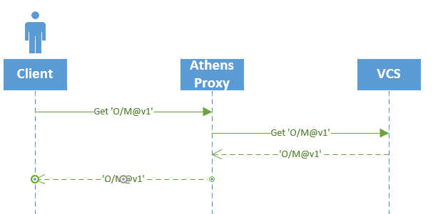

# Architecture overview

## High level view

From a very high level we recognize 4 major components of the system. 2 internal and 2 external.

2 external are:
- Client - which is a Go CLI
- VCS - e.g github, providing its API

2 internal are:
- Athens
    - proxy
    - [PROXY.md](./PROXY.md)
- Olympus
    - registry
    - source of truth
    - [REGISTRY.md](./REGISTRY.md)

## Communication flow

This is the story of a time long ago. A time of myth and legend when the ancient Gods were petty and cruel and they plagued build with irreproducibility. 
Only one project dared to challenge their power...Athens. Athens possessed a strength the world had never seen. Filling its cache.

### Clean plate

At the beginning there's theoretical state when cache of proxy and registry is empty.

When User makes request at this ancient time, it works as described on the flow below.

- User contacts Athens asking for module M in version v1.0
- Athens checks whether or not it has this module in its storage. It has not.
-So it responds with redirect to Olympus and schedules its own job to check with Olympus in few units of time, giving Olympus space to fill its cache.
- User receives redirect to Olympus and asks it for module M in version v1.0
- Olympus is cache free as well, so it asks underlying VCS (e.g github.com) for a module.
- After it receives all the bits, it stores it into its own cache and serves it to the User.
- User receives module and is happy.
- Sometimes around this time Athens asks Olympus for module M in version v1.0 as well. Olympus, now aware of this module, serves it so Athens can fill its own cache.

### New proxy joins the party

At this point we have 1 proxy and 1 registry, each of them aware about module M. Now new proxy joins with empty cache.

We can see the flow is very similiar.

- User contacts new proxy, which checks internal storage to find out it is missing the module. 
    - Redirects to Olympus,
    - Schedules new cache fill job.
- User contacts Olympus aware of module and receives response right away.
- Proxy, after some time, contacts Olympus and fills its cache.

### Happy path

Now we have all proxies and Olympus aware of module M. So when new user asks for M in version v1.0 it is served right away. Without proxy bothering Olympous nor VCS.

### Asking about private things

There are time when you do not want to know the mighty gods of Olympus about you desires. E.g:
- You are requesting private module,
- Communication is just disabled.

In this case 
- User contacts Athens asking for private module. 
- Athens detects this repo is private and checks its storage. It does not find it there.
- Athens contacts VCS directly.
- VCS responds with a module which is then stored into a cache Synchronously.
- Module is served to the User.

