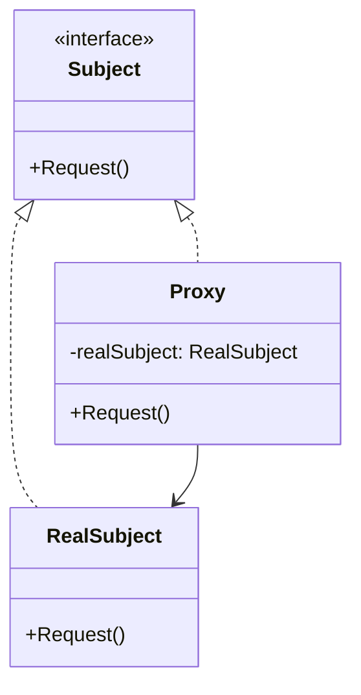

# 代理模式

代理模式是一种结构型设计模式，它允许你提供一个替代物或占位符来控制对另一个对象的访问。

## 目的
- 控制对原始对象的访问
- 作为原始对象的替代或占位符
- 在不改变客户端代码的情况下添加额外功能

## 适用场景
- 远程代理：为位于不同地址空间的对象提供本地代表
- 虚拟代理：根据需要创建开销大的对象
- 保护代理：控制对原始对象的访问权限
- 智能引用：在访问对象时执行额外操作

## 结构


## 参与者
- **Subject**: 定义RealSubject和Proxy的通用接口
- **RealSubject**: 定义代理所代表的真实对象
- **Proxy**: 
  - 维护一个引用使得代理可以访问真实对象
  - 控制对真实对象的访问
  - 可能负责创建和删除真实对象

## 优点
- 可以在不修改客户端代码的情况下控制对对象的访问
- 可以在访问对象时执行额外操作
- 可以延迟真实对象的创建和初始化
- 可以实现远程访问

## 缺点
- 可能会增加响应时间
- 增加了系统的复杂性
- 需要额外的代码来实现代理功能

## 示例代码
```python
from abc import ABC, abstractmethod

# Subject接口
class Subject(ABC):
    @abstractmethod
    def request(self):
        pass

# RealSubject
class RealSubject(Subject):
    def request(self):
        print("RealSubject: Handling request.")

# Proxy
class Proxy(Subject):
    def __init__(self, real_subject: RealSubject):
        self._real_subject = real_subject

    def request(self):
        if self.check_access():
            self._real_subject.request()
            self.log_access()

    def check_access(self):
        print("Proxy: Checking access prior to firing a real request.")
        return True

    def log_access(self):
        print("Proxy: Logging the time of request.", end="\n\n")

# 客户端代码
def client_code(subject: Subject):
    subject.request()

if __name__ == "__main__":
    print("Client: Executing the client code with a real subject:")
    real_subject = RealSubject()
    client_code(real_subject)

    print("Client: Executing the same client code with a proxy:")
    proxy = Proxy(real_subject)
    client_code(proxy)
```

## 相关模式
- **Adapter**: 适配器为对象提供不同的接口，而代理提供相同的接口
- **Decorator**: 装饰器与代理结构相似，但目的不同
- **Facade**: 外观模式为复杂子系统提供简化接口

## 实际应用
- 远程方法调用（RMI）
- 虚拟代理用于延迟加载大图像
- 保护代理用于访问控制
- 智能指针用于资源管理